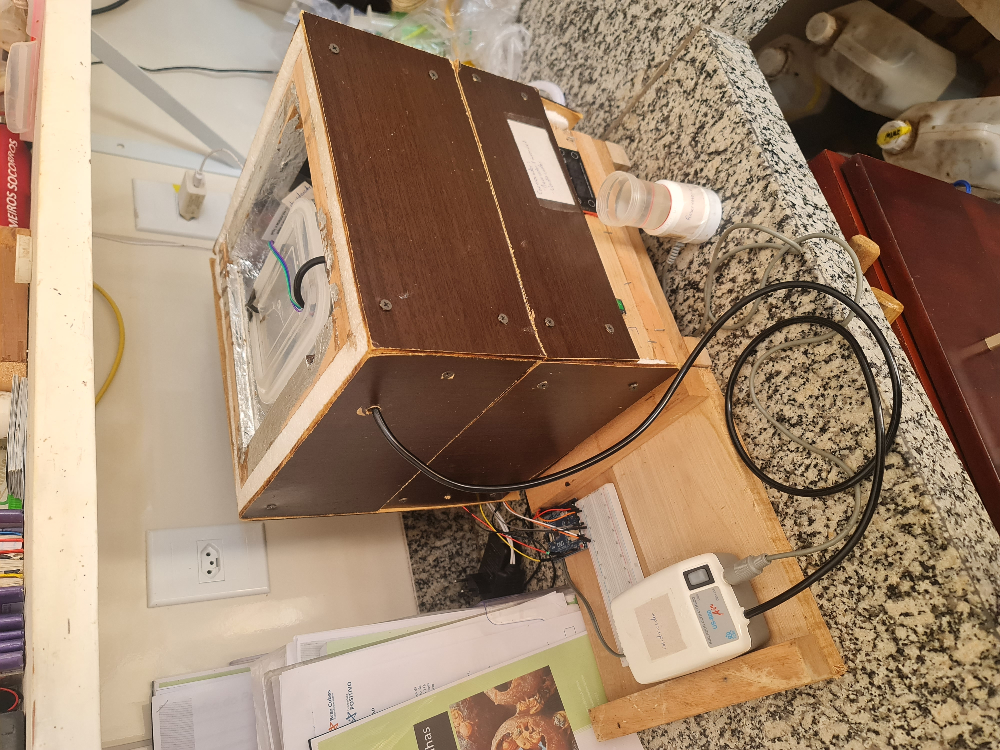

## ESTUFA MELIPONA

__É um projeto para o Instituto Abelha Nativa (Brasília, DF), e tem como o objetivo fazer a incubação de abelhas nativas até elas estarem prontas para serem introduzidas novas colonias__

### Utilização:
-> Após *ligado na energia, ajustar o Controlador1* com a temperatura e umidade adequada para a *primeira semana*. Será necessário estabilizar, ou seja, a *temperatura deve ajustada até o valor necessário, e a umidade observada e reabastecida até o necessário.*
-> O primeiro ciclo iniciará automaticamente. (O Controlador1 ficará ocioso até a proxima semana)
-> *Após uma semana o Controlador2* iniciará a *verificação de umidade para tentar diminuir a mesma.*
-> Na *segunda semana* se faz o *reajuste de umidade no Controlador1.*
-> Na *segunda semana* conectar o *desumidificador+silica no Controlador2*. Adicicionando o sal a incubadora para diminuir assim a umidade. Mais uma vez se observa a incubadora para ver se foi estabalizada.

## Observações:
* Os componentes citados acima estão sendo descritos na pasta __main-code__.
* Veja o vídeo para maiores esclarecimentos sobre a utilização.

<picture>
    
</picture>

* Com isso, a incubadora conta com dois controladores, Controlador1 (um controlador de temperatura e umidade simples para aumentar ambas quando for necessário) e Controlador2 (uma placa Arduino Uno, para diminuir a umidade quando necessário e fazer o controle das *rotinas*)

* Nesse repositório encontrara as explicações das rotinas na pasta __main-code__ juntamente com o código com as rotinas e explicação do circuito e funcionamento geral da estufa. Não foi abordado o funcionamento do Controlador1, pois esse é  apenas um controlador analógico para controle de temperatura.

OBS.: A pasta __resources__ são os estudos realizados com os componentes testados para utilização no projeto, mas nem todos foram utilizados. E a pasta __src__ contem as imagens do projeto.
